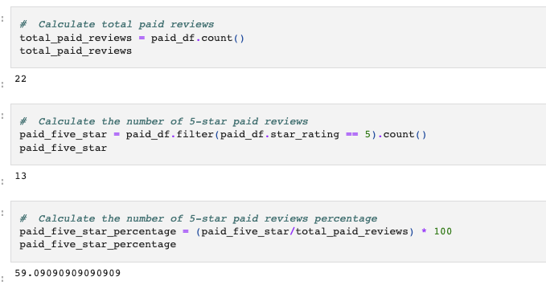
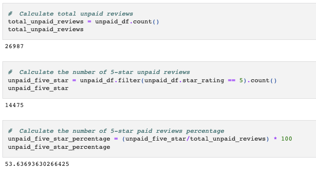

# Amazon_Vine_Analysis

## Overview of the analysis

In this analysis i have analyzed Amazon reviews written by members of the paid Amazon Vine program. The Amazon Vine program is a service that allows manufacturers and publishers to receive reviews for their products. I have reviewed dataset of shoes and used PySpark tp perform the ETL process to extract the dataset, transform the data, connect to an AWS RDS instance, and load the transformed data into pgAdmin. Next, i have used Pandas to determine if there is any bias toward favorable reviews from Vine members in your dataset.

## Results

- There were total 22 Vine(paid) reviews and 26987 non-Vine(unpiad) reviews.
- 13 paid reviews were 5 stars and 14475 unpiad reviews were 5 stars.
- 59.09 % of the paid reviews were 5 stars and 53.63% of the unpaid reviews were 5 star.

  
  

## Summary

In your summary, state if there is any positivity bias for reviews in the Vine program. Use the results of your analysis to support your statement. Then, provide one additional analysis that you could do with the dataset to support your statement.
